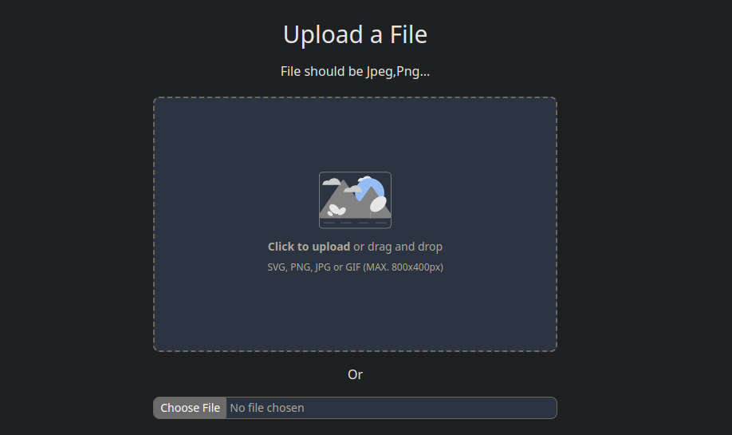

<!-- Please update value in the {}  -->

<h1 align="center">File uploader</h1>

   Solution for a challenge from  <a href="http://devchallenges.io" target="_blank">Devchallenges.io</a>.

  <h3>
    <a href="https://image-uploader-fxdwv4mil-diazlisbeh.vercel.app/?vercelToolbarCode=yh5jZLOHNN31HVu">
      Demo
    </a>
     | 
    <a href="https://github.com/diazlisbeh/image-uploader">
      Solution
    </a>
     | 
    <a href="https://devchallenges.io/challenges/O2iGT9yBd6xZBrOcVirx">
      Challenge
    </a>
  </h3>

<!-- TABLE OF CONTENTS -->

## Table of Contents

- [Overview](#overview)
  - [Built With](#built-with)
- [Features](#features)
- [Contact](#contact)

<!-- OVERVIEW -->

## Overview

This is a simple project in which you can upload an image to a repository

### Built With

<!-- This section should list any major frameworks that you built your project using. Here are a few examples.-->

- [React](https://reactjs.org/)
- [Tailwind](https://tailwindcss.com/)
- [.NET](https://dotnet.microsoft.com/es-es/learn/dotnet/what-is-dotnet)
- [Azure](https://azure.microsoft.com/en-us/products/app-service/web)

## Features

<!-- List the features of your application or follow the template. Don't share the figma file here :) -->

This application/site was created as a submission to a [DevChallenges](https://devchallenges.io/challenges) challenge. The [challenge](https://devchallenges.io/challenges/O2iGT9yBd6xZBrOcVirx) was to build an application to complete the given user stories.

## Contact

- GitHub [diazlisbeh](https://github.com/diazlisbeh)
- Linkedin [diazlisbeh](https://www.linkedin.com/in/diazlisbeh/)
